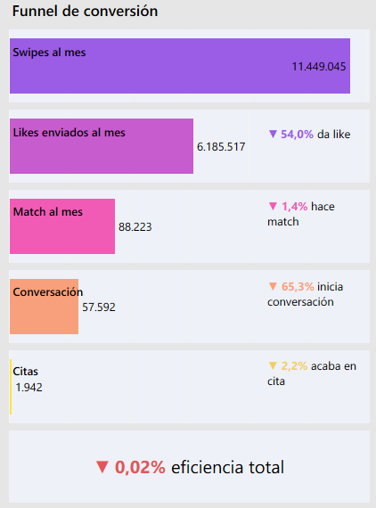
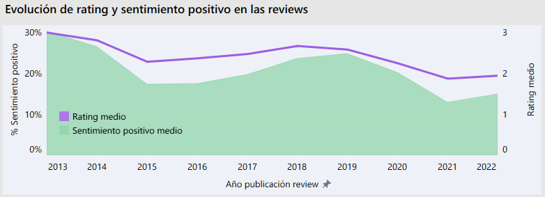

# 📱 Dating Apps Market Analysis
### ¿Mucho swipe, poco éxito? Radiografía estratégica del mercado de apps de citas en España

> Proyecto de visualización en Tableau del Bootcamp de Data Analytics — Adalab  
> Desarrollado por **Arantxa Barea** y **María Granero**

---

## 📌 Índice

1. [Executive Summary](#-executive-summary)
2. [Problema de negocio](#-problema-de-negocio)
3. [Datasets](#️-datasets)
4. [Enfoque analítico](#-enfoque-analítico)
5. [Hallazgos clave](#-hallazgos-clave)
6. [Dashboards](#-dashboards-tableau)
7. [Stack tecnológico](#️-stack-tecnológico)
8. [Estructura del repositorio](#-estructura-del-repositorio)
9. [Cómo ejecutar el proyecto](#️-cómo-ejecutar-el-proyecto)
10. [Posibles mejoras futuras](#-posibles-mejoras-futuras)
11. [Estado del proyecto](#-estado-del-proyecto)
12. [Equipo](#-equipo)

---

## 🚀 Executive Summary

El mercado de apps de citas combina volumen masivo de interacción, alta penetración digital y competencia intensa entre plataformas. Sin embargo, los datos cuentan una historia diferente:

| Métrica | Valor | Lectura |
|--------|-------|---------|
| Eficiencia del funnel completo | 0,02% | De cada 4.400 swipes, 1 termina en cita |
| Sentimiento negativo en reviews | 64,8% | Dos de cada tres usuarios expresan insatisfacción |
| Usuarios que llegan a una cita | 3,9% | La mayoría nunca llega al objetivo real |
| Caída reputacional 2018→2021 | −38 pp | Hinge pasa de 50% positivo a 12% en 3 años |

> **La conclusión central:** el mercado no tiene un problema de uso. Tiene un problema de eficacia percibida. La brecha entre esfuerzo y resultado es el verdadero reto del sector.

---

## 🎯 Problema de negocio

Las plataformas crecen en usuarios, pero los datos plantean tres preguntas críticas que este proyecto responde con datos:

- ¿Están generando valor real para el usuario?
- ¿La experiencia está alineada con el volumen de actividad?
- ¿El liderazgo en mercado implica liderazgo en satisfacción?

---

## 🗃️ Datasets

El proyecto trabaja con dos fuentes de datos complementarias:

### 1 · Dataset sintético — Mercado España

- 50.000 usuarios simulados con calibración sobre estudios de audiencia digital (dic. 2024)
- 36 variables por usuario: perfil demográfico, comportamiento, funnel completo y satisfacción
- Representa el mercado español 2026 con 10 apps: Tinder, Badoo, Grindr, Bumble, Hinge, Meetic, Wapo, Boo, LOVOO, Jaumo
- Generado íntegramente con Python garantizando coherencia interna (cero incoherencias en el funnel)

### 2 · Dataset real — Reviews internacionales

- 49.872 reviews reales de Google Play Store (2013–2022)
- 3 plataformas: Tinder, Bumble, Hinge
- Enriquecido con análisis de sentimiento NLP mediante Transformers (HuggingFace)
- Variables: rating, texto, thumbs up, fecha, app, sentimiento detectado, sentiment score

> ⚠️ **Nota metodológica:** ambos datasets son complementarios pero no directamente comparables. El sintético representa comportamiento español; las reviews son internacionales y en inglés. Esta distinción se mantiene explícita a lo largo del análisis.

---

## 🧠 Enfoque analítico

El análisis se estructura en dos dimensiones:

### 🇪🇸 Dimensión 1 — Comportamiento (dataset sintético)

Análisis del funnel completo de conversión:

```
Swipe → Like enviado → Like recibido → Match → Conversación → Cita
 229        124              17           1,76       1,15         3,9%
```

**Hallazgo crítico:** el sistema no falla al final. Falla en el match.  
La tasa de conversión de like enviado a match es del **1,43%** — la caída estructural ocurre en esa fase, no en la conversación ni en la cita.

Además, el análisis revela una **brecha de género profunda**:

| Métrica | Hombres | Mujeres | Ratio |
|---------|---------|---------|-------|
| Matches / mes | 0,46 | 5,35 | 11,7× |
| Tasa de éxito match | 0,19% | 2,90% | 15× |
| % con cita | 1,9% | 9,3% | 4,9× |

### 🌍 Dimensión 2 — Reputación (dataset real + NLP)

Análisis de percepción a través de 49.872 reviews con tres ejes:

- **Comparativa entre apps:** Hinge lidera en rating (2,85) y sentimiento positivo (34,1%). Tinder en última posición en ambas métricas.
- **Evolución temporal:** deterioro simultáneo en las tres plataformas entre 2018 y 2021, independientemente del crecimiento de usuarios.
- **Inconsistencias rating-texto:** el 4,8% de reviews con 5 estrellas contienen texto negativo — Tinder alcanza el 5,2%.
- **Validación social:** las reviews negativas reciben 2,2× más thumbs up que las positivas.

---

## 💡 Hallazgos clave

```
┌─────────────────────────────────────────────────────────────────┐
│  El funnel real: 229 swipes → 1,76 matches → 3,9% llega a cita │
│  Hacer más swipes no mejora las probabilidades (r = −0,105)     │
└─────────────────────────────────────────────────────────────────┘
```




<br>

- **Eficiencia 0,023%:** de cada 4.400 swipes, estadísticamente 1 termina en cita
- **Brecha de género:** las mujeres obtienen 11,7× más matches con menos swipes
- **Hinge:** el caso más llamativo: pasa de 50% positivo (2018) a 12% (2021) — caída de 38 puntos en 3 años
- **La queja conecta más:** las reviews negativas reciben en promedio 3,91 thumbs up vs 1,77 las positivas
- **Paradoja del mercado:** el volumen de usuarios crece mientras la satisfacción cae sin excepción en todas las plataformas

---

## 📊 Dashboards Tableau

El proyecto incluye 3 dashboards interactivos en formato 16:9 (1366×768 px):

| Dashboard | Pregunta central | Elementos clave |
|-----------|-----------------|-----------------|
| DB1 · Radiografía del Usuario de Apps de Citas | Perfil sociodemográfico | Mapa CCAA · Distribución por app · Distribución edad |
| DB2 · Performance y Funnel de Conversión en Apps de Citas | Comportamiento y engagement | Funnel · Scatter swipes/éxito por género |
| DB3 · El veredicto de los usuarios | Sentimiento y satisfacción | Línea temporal · Stacked bar · Boxplot rating/sentimiento |

> 📌 **Nota:** los dashboards están disponibles en el archivo `reports/dashboards/dating_apps_market_analysis.twbx`. Próximamente en Tableau Public.

---

## 🛠️ Stack tecnológico

| Categoría | Herramienta | Uso |
|-----------|-------------|-----|
| Lenguaje | Python 3.11 | Todo el pipeline |
| Manipulación de datos | Pandas · NumPy | EDA, limpieza, transformación |
| Visualización exploratoria | Matplotlib · Seaborn | Análisis previo a Tableau |
| NLP | Transformers (HuggingFace) | Análisis de sentimiento en reviews |
| Visualización ejecutiva | Tableau Public | 3 dashboards interactivos |

---

## 📂 Estructura del repositorio

```
📦 dating-apps-market-analysis
│
├── 📁 data/
│   ├── raw/                          # Datasets originales
│   └── processed/                    # Datasets limpios y preparados
│
├── 📁 notebooks/
│   ├── 00_dataset_generation.ipynb   # Generación dataset sintético
│   ├── 01_eda.ipynb                  # Análisis exploratorio
│   ├── 02_data_cleaning.ipynb        # Limpieza y validación
│   └── 03_analisis_sentimiento.ipynb # NLP con Transformers
│
├── 📁 docs/
│   ├── eda/                          # Outputs del análisis exploratorio
│   └── data_cleaning_report_reviews.md
│
├── 📁 reports/
│   ├── dashboards/
│   │   └── dating_apps_market_analysis.twbx
│   └── figures/
│       ├── funnel_conversion.png
│       ├── swipes_vs_success_gender.png
│       ├── rating_sentiment_by_app.png
│       ├── sentiment_polarization_by_app.png
│       └── evolution_rating_sentiment.png
│
├── requirements.txt
├── .gitignore
└── README.md
```

---

## ▶️ Cómo ejecutar el proyecto

**1 · Clonar el repositorio**
```bash
git clone https://github.com/mariagranero/proyecto-da-promo-64-modulo-4-team-2.git
cd dating-apps-market-analysis
```

**2 · Crear entorno virtual**
```bash
python -m venv venv
source venv/bin/activate        # Mac/Linux
venv\Scripts\activate           # Windows
```

**3 · Instalar dependencias**
```bash
pip install -r requirements.txt
```

**4 · Ejecutar los notebooks en orden**
```
00_dataset_generation.ipynb   →  Genera el dataset sintético de 50.000 usuarios
01_eda.ipynb                  →  Análisis exploratorio estructurado
02_data_cleaning.ipynb        →  Limpieza y validación de ambos datasets
03_analisis_sentimiento.ipynb →  NLP con HuggingFace Transformers
```

**5 · Abrir el dashboard**

Abre el archivo `reports/dashboards/dating_apps_market_analysis.twbx` en Tableau Desktop o Tableau Public.

---

## 🔮 Posibles mejoras futuras

- Publicación de los dashboards en Tableau Public
- Ampliación del dataset sintético con variables de comportamiento post-cita
- Incorporación de más plataformas al análisis de reviews (Bumble internacional, OkCupid)
- Análisis de sentimiento en español para reviews del mercado local
- Desarrollo de un modelo predictivo de satisfacción y churn por perfil de usuario.
- Segmentación avanzada por cohortes de edad y comunidad autónoma

---

## ✅ Estado del proyecto

| Fase | Estado |
|------|--------|
| Generación del dataset sintético | ✅ Completado |
| EDA y limpieza de datos | ✅ Completado |
| Análisis de sentimiento (NLP) | ✅ Completado |
| Diseño y desarrollo de dashboards | ✅ Completado |

---

## 👩‍💻 Equipo

El proyecto fue desarrollado de forma colaborativa en todas sus fases — análisis, limpieza, NLP y visualización — en el marco del **Bootcamp de Data Analytics de Adalab**. El dataset sintético fue diseñado por Arantxa Barea como parte del trabajo conjunto.

<table>
  <tr>
    <td align="center">
      <b>Arantxa Barea</b><br><br>
      <a href="https://www.linkedin.com/in/arantxa-barea">
        
      </a>
      &nbsp;
      <a href="https://github.com/arantxa-90">
        
      </a>
    </td>
    <td align="center">
      <b>María Granero</b><br><br>
      <a href="https://www.linkedin.com/in/mar%C3%ADa-granero-l%C3%B3pez/">
        
      </a>
      &nbsp;
      <a href="https://github.com/mariagranero">
        
      </a>
    </td>
  </tr>
</table>

---

## 🧩 Metodología resumida

```
Generación / ingestión de datos
        ↓
EDA estructurado
        ↓
Limpieza y preprocesado
        ↓
Análisis de sentimiento (NLP)
        ↓
Visualización ejecutiva (Tableau)
        ↓
Comunicación de insights
```

Esto garantiza trazabilidad completa desde la fuente de datos hasta las conclusiones estratégicas.

---

## 📄 Licencia

Proyecto académico desarrollado en el marco del Bootcamp de Data Analytics de Adalab.  
Uso educativo — no contiene datos reales de usuarios ni información sensible.

---

## 💬 Conclusión

> *"El mercado no tiene un problema de uso.*  
> *Tiene un problema de eficacia percibida.*  
> *La brecha entre esfuerzo invertido y valor percibido es el principal riesgo estratégico del sector."*

---

<div align="center">
  <sub>Proyecto desarrollado en el Bootcamp de Data Analytics · Adalab · 2026</sub>
</div>